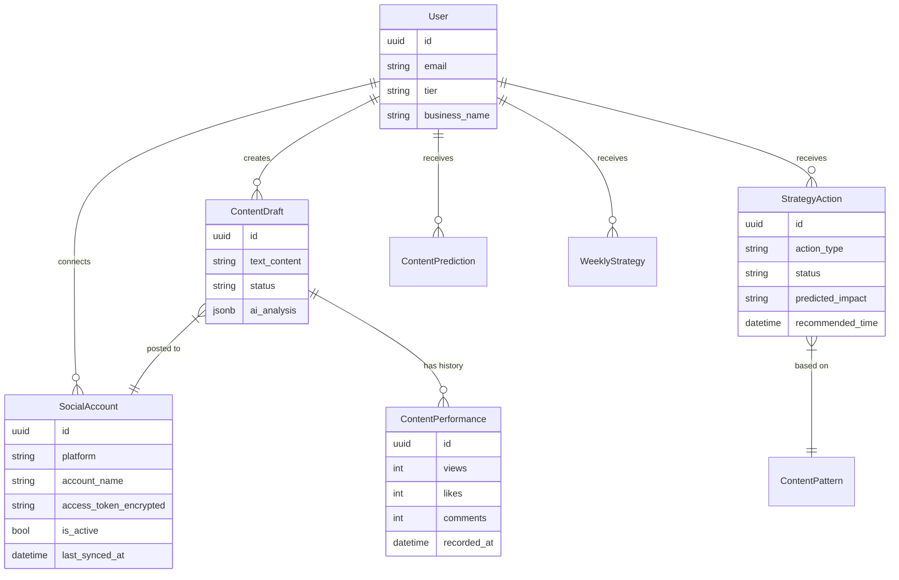
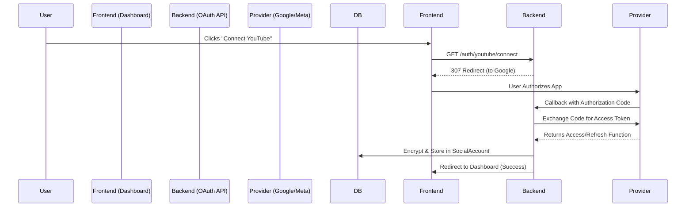
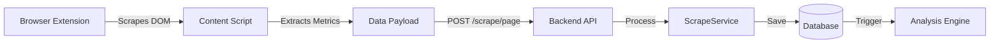
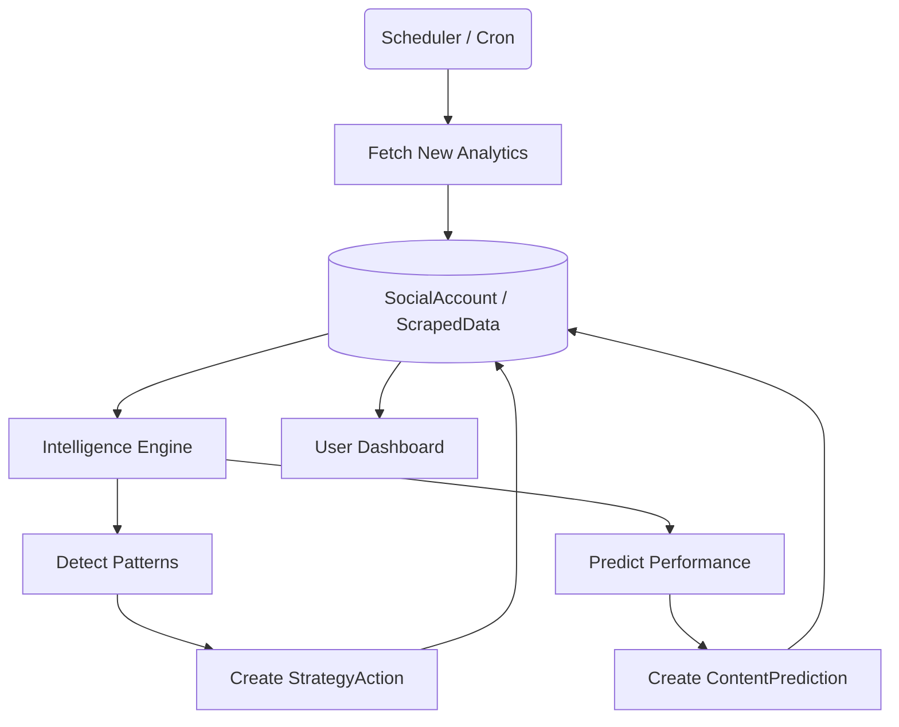
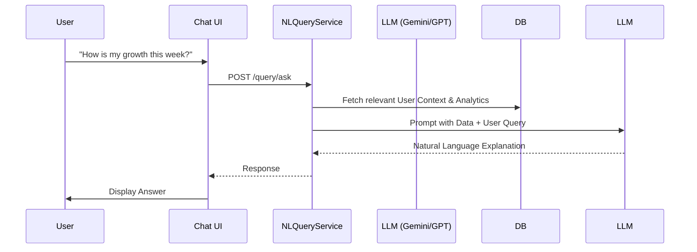

# Creator OS

AI-powered content creation operating system.
# Creator OS - System Architecture

## Entity Relationship Diagram (ERD)

---

## Core Workflows

### 1. Social Account Connection (OAuth)
Direct API access allows Creator OS to fetch verified analytics and post content.

### 2. Data Ingestion & Scraping
The browser extension acts as a sensory organ, capturing real-time data from user browsing.

### 3. AI Intelligence Loop
Background processes analyze data to generate actionable strategy.

### 4. Natural Language Query (JARVIS)
User asks questions about their data using natural language.

## Directory Structure Overview

-   **`backend/app/models`**: Database Schema (SQLModel)
-   **`backend/app/api/v1`**: REST Endpoints (FastAPI)
-   **`backend/app/services`**: Business Logic & AI Orchestration
-   **`web-app`**: React Dashboard (Frontend)
-   **`extension`**: Chrome Extension (Data Ingestion)
